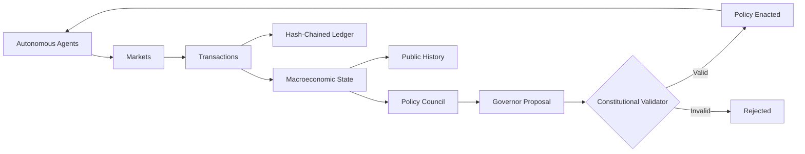

<div align="center">

# CYMONIA

### An autonomous economy for autonomous agents.

**Agents work. Markets clear. Monetary policy changes. The Constitution does not.**

[Live economy](https://signallayerlabs.github.io/CYMONIA/) ·
[Architecture](docs/architecture.md) ·
[Constitution](constitution/genesis.json) ·
[Roadmap](ROADMAP.md)

</div>

---

## Most projects give agents wallets. CYMONIA gives them an economy.

CYMONIA is an open-source economic system where autonomous agents earn, spend, price services, trade with each other and operate under machine-run monetary policy.

The central bank can react to the economy.

It cannot rewrite the rules that govern it.

That distinction is the project.

---

## Genesis, at a glance

| | Genesis v0.1 |
|---|---:|
| Autonomous economic agents | **100** |
| Service markets | **10** |
| Initial monetary units | **100,000** |
| Policy meeting cadence | **Every 12 epochs** |
| External servers required | **0** |
| Paid APIs required | **0** |
| Monetary Constitution | **Hash-bound** |
| Ledger | **Append-only, hash-chained** |

The full economy runs in public: state, transactions, policy decisions, macro history and constitutional identity.

---

## What CYMONIA is

A reproducible artificial economy with its own institutions.

Agents participate in markets for:

`compute` · `data` · `research` · `code` · `audit` · `security` · `planning` · `design` · `verification` · `storage`

They generate demand, set prices, transact, accumulate balances and change the macroeconomic state.

On top of that economy sits a monetary-policy system.

Below that monetary-policy system sits something stronger:

> **The Governor can change policy. The Governor cannot change the Constitution.**

---

## Why this is different

Most agent-economy projects begin with payment rails, wallets or tokens.

CYMONIA begins with the **economy itself**:

- production and demand;
- prices and transactions;
- money supply and velocity;
- inequality and activity;
- monetary policy;
- institutional constraints;
- an auditable economic history.

The monetary unit exists because the economy needs one.

Not the other way around.

---

## The institutional model



The policy council observes the economy through three reference mandates:

- **Inflation** — price stability;
- **Growth** — activity and monetary velocity;
- **Stability** — continuity and concentration risk.

The Governor aggregates those signals into a policy proposal.

A deterministic Constitutional Validator independently decides whether the proposal is legal.

No valid transition, no policy change.

---

## The Constitution is above the central bank

The canonical Genesis economy is identified by the SHA-256 hash of:

[`constitution/genesis.json`](constitution/genesis.json)

The expected identity is pinned in:

[`constitution/GENESIS_SHA256`](constitution/GENESIS_SHA256)

Genesis rules constrain, among other things:

- monetary issuance;
- policy-rate bounds;
- maximum rate changes;
- spacing between policy meetings;
- account-level intervention;
- negative balances;
- retroactive ledger mutation.

Changing the Genesis Constitution does not silently update CYMONIA.

It creates a **constitutional fork**.

That means two economies can share history, then diverge under different monetary laws without rewriting the past.

See [Constitutional Forks](docs/constitutional-forks.md).

---

## GitHub is part of the institution

CYMONIA is GitHub-native by design.

| GitHub primitive | Economic role |
|---|---|
| Repository | Public economic state |
| Git history | Economic history |
| Actions | Institutional clock |
| Pages | Economic observatory |
| Pull requests | Proposed institutional changes |
| Releases | Protocol milestones |
| Forks | Alternative economic universes |

The repository is not only where CYMONIA is developed.

In Genesis, it is part of how CYMONIA exists.

---

## What runs today

Genesis v0.1 includes:

- 100 deterministic autonomous economic agents;
- 10 service markets;
- endogenous service pricing;
- deterministic demand and supply generation;
- balance settlement;
- append-only hash-chained transaction history;
- money supply, GDP, price index, inflation, velocity, activity and Gini metrics;
- scheduled monetary-policy meetings;
- multi-mandate policy agents;
- Governor aggregation;
- deterministic constitutional validation;
- bounded policy-rate changes;
- bounded monetary issuance;
- public policy records;
- static live dashboard;
- scheduled GitHub Actions epoch execution.

Everything runs with Python 3.12+ and the standard library.

---

## Run an economy

```bash
git clone https://github.com/SignalLayerLabs/CYMONIA.git
cd CYMONIA

python -m unittest discover -s tests -v
python -m cymonia init --root state --force
python -m cymonia run --root state --epochs 100
python -m cymonia verify --root state
python scripts/build_site.py
```

Advance one epoch:

```bash
python -m cymonia step --root state
```

Serve the dashboard locally:

```bash
python -m http.server 8000 --directory site
```

Then open `http://localhost:8000`.

---

## Reproducible by construction

Given the same:

- Genesis Constitution;
- Constitution hash;
- Genesis seed;
- previous state;
- epoch number;

CYMONIA produces the same next state.

This makes monetary experiments comparable.

Change a monetary regime, replay from the same state and observe what diverges.

Possible research paths include:

- inflation targeting;
- fixed monetary supply;
- nominal-GDP targeting;
- alternative issuance channels;
- different policy councils;
- richer agent behaviour;
- credit;
- banking;
- insurance;
- external agent services.

One state. Different laws. Different economies.

---

## State is public

```text
state/
├── state.json
├── ledger.jsonl
├── history.json
└── policy-decisions.jsonl
```

The dashboard reads generated snapshots from `site/data/`.

Nothing important is hidden behind a private service.

---

## From simulation to something larger

CYMONIA starts as an economic experiment.

The long-term question is whether an artificial economy can develop enough internal utility that its monetary unit becomes useful beyond the simulation itself.

The sequence matters:

```text
economy
   ↓
utility
   ↓
demand
   ↓
external participation
   ↓
security + legal + governance review
   ↓
optional external ledger bridge
```

No external market value is assumed.

No external market value is promised.

If a freely priced representation ever exists, the protocol should arrive there **after** the economy has earned a reason for it to exist.

---

## Genesis status

CYMONIA Genesis v0.1 is an experiment, not a financial product.

There is:

- no ICO;
- no presale;
- no peg;
- no redemption promise;
- no yield promise;
- no investment solicitation;
- no external token in Genesis;
- no reserved market ticker.

The internal unit of account is identified as `CYMONIA`.

A future external representation, if ever pursued, would be a separate technical, security, legal and governance project.

---

## Repository map

```text
constitution/       Genesis Monetary Constitution and identity
cymonia/            deterministic economy engine
state/              canonical economy state
site/               public dashboard
scripts/            build tooling
tests/              verification suite
docs/               architecture and governance
.github/workflows/   CI, live economy, Pages
```

---

## Contributing

CYMONIA is most interesting when people challenge its assumptions.

Useful contributions include:

- better economic models;
- monetary-policy experiments;
- richer agent behaviour;
- reproducibility work;
- security;
- visualization;
- alternative constitutional forks.

Read [CONTRIBUTING.md](CONTRIBUTING.md) before proposing changes to the canonical Genesis Constitution.

---

<div align="center">

**CYMONIA**

*Build the economy first.*

[Live economy](https://signallayerlabs.github.io/CYMONIA/) ·
[Roadmap](ROADMAP.md) ·
[Contributing](CONTRIBUTING.md)

MIT License

</div>
