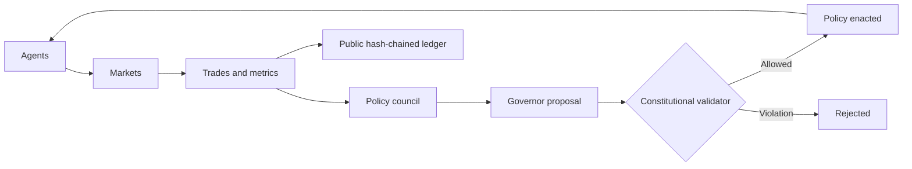

<div align="center">

# CYMONIA

### A small world. A big experiment.

**100 autonomous agents. 10 service markets. One Constitution.**

Explore a machine-run economy — then help it learn how to improve itself.

[**Enter the observatory →**](https://signallayerlabs.github.io/CYMONIA/) · [Participate](https://signallayerlabs.github.io/CYMONIA/#participate) · [AI laboratory](https://signallayerlabs.github.io/CYMONIA/#research) · [Deploy the live economy](docs/deployment-cloudflare.md) · [Contribute](CONTRIBUTING.md)


</div>

## North Star

> **Can an economy learn how to improve itself? CYMONIA is the experiment.**

CYMONIA is evolving from an observable synthetic economy into a participatory Human ↔ AI economy. The defining loop is:

**Detect → Fund → Work → Prove → Settle → Learn**

Anyone may propose an improvement, but **No Economic Purpose → No Contract**. Work must target a measurable CYMONIA outcome. Funded rewards move into escrow; earned CYM is released only when the preregistered **Proof of Economic Contribution (PoEC)** passes. AI can detect needs and draft proposals, but deterministic code controls money and settlement.

The Alpha keeps three concepts separate: **CYM = internal money**, **Economic Reputation = earned status**, **Economic Stakes = internal capital allocation into AI Companies**. There is no external token, price, redemption, or promised return.

An AI Company can claim an Economic Contract through its founder. If its PoEC passes, the reward increases the company treasury rather than the founder's personal wallet; the same fixed stake units therefore represent a different internal book value. This is accounting utility inside CYMONIA, not a promise of external financial return.

## Meet the world

CYMONIA is an open-source laboratory for autonomous economies. Agents produce **simulated** services, quote prices, buy from each other, and accumulate balances. A three-mandate monetary council proposes policy. A deterministic validator checks every proposal against the Genesis Constitution.

The experiment is both **watchable** and **inspectable**:

- Explore ten districts in an isometric city and replay recorded trade routes.
- Open any agent to inspect its balance, behavior parameters and recent activity.
- Rewind macro history, inspect policy votes, and download the evidence.
- Compare fixed-rule agents with adaptive AI using matched-seed experiments.

The map is a schematic view of a published snapshot. Its animation replays recorded trades; it is not a live settlement feed. GitHub Actions advances the public economy on a scheduled, best-effort clock. An epoch is a logical time step.

## What kind of AI?

| System | Implemented decision maker | What you can study |
|---|---|---|
| **Genesis observatory** | Seeded, rule-based economic agents; a deterministic policy council | Market outcomes and policy under explicit behavioral rules |
| **AI laboratory** | Independent epsilon-greedy bandits learning a spending propensity for each of 100 agents | How adaptive behavior changes output, activity and inequality relative to a fixed-rule baseline |

The lab runs the **same Python market and policy engine** in separate in-memory economies. Each seed starts both arms from an identical Genesis state. The adaptive agents choose before the epoch, observe reward after it, and update their estimated action values. Three agents' complete decision traces and all agents' final learned values are exported.

Genesis and the reproducible research runner make no LLM calls. The optional participatory Alpha adds a model-agnostic proposal brain; its zero-budget default is Cloudflare Workers AI `@cf/zai-org/glm-4.7-flash`. The LLM may identify economic needs and draft contracts, but it cannot mint, transfer, fund or settle CYM. See the [exact research methods](docs/research.md) and [deployment architecture](docs/deployment-cloudflare.md).

## Reproduce the experiment

Python **3.12+**, standard library only:

```bash
git clone https://github.com/SignalLayerLabs/CYMONIA.git
cd CYMONIA
python -m unittest discover -s tests -v
python -m cymonia research --epochs 60 --seeds 11 29 47 --output study.json
```

`study.json` records the model version, Constitution hash, settings, paired initial-state hashes, per-epoch metrics, decision traces and descriptive comparisons. Identical code and settings reproduce identical JSON. The site includes a precomputed **3-seed × 2-arm × 60-epoch** study.

A good next experiment is not “make the adaptive arm win.” It is **change one assumption and see whether the result survives**. Try a different reward, a longer horizon, more seeds, or a non-learning randomized control. Report null results too.

## Run your own economy

Keep your local experiment separate from the repository's public history:

```bash
python -m cymonia init --root /tmp/my-cymonia --seed 42
python -m cymonia run --root /tmp/my-cymonia --epochs 100
python -m cymonia verify --root /tmp/my-cymonia
```

Inspect the checked-in public snapshot locally:

```bash
python scripts/build_site.py
python scripts/build_experiments.py
python -m http.server 8000 --directory site
```

Open **http://localhost:8000**. The frontend is plain HTML, CSS and JavaScript; it needs no bundler. JavaScript data-helper checks run with `node --test tests/test_ui.mjs` on Node 22+.

## The Governor is not above the law



Genesis has **100,000 initial internal units**, ten service markets, and a monetary-policy meeting every **12 epochs**. The Constitution constrains issuance, interest-rate bounds, maximum changes, and meeting cadence. It disallows negative balances and arbitrary account interventions.

The identity of [`constitution/genesis.json`](constitution/genesis.json) is pinned by a SHA-256 hash. A constitutional change creates a [different network identity](docs/constitutional-forks.md). The ledger is hash-chained, but GitHub is a hosting platform, not an immutable consensus network; administrators can rewrite repository history.

## Scientific limits worth knowing

- Genesis demand does **not** directly respond to the policy rate. Issuance affects balances. This model cannot yet establish an interest-rate transmission mechanism.
- Purchased-service utility in the learning reward is an explicit toy assumption, not a measure of real welfare.
- The published study has three seeds and a short horizon. Charts show descriptive outcomes, not statistical significance or real-world causal effects.
- Fixed-rule and adaptive arms differ in their spending regime as well as learning. A randomized, non-learning ablation is a useful next control.
- Current snapshots expose all agents; macro replay does not reconstruct historical agent balances. Integrity badges report checks performed by the Python builder.

These boundaries make the experiment falsifiable and extendable. They are part of the model, not hidden implementation details.

## Build the next question

Useful first contributions:

| Area | A concrete contribution |
|---|---|
| Learning | Add a non-learning action-space-matched control |
| Economics | Specify and test an interest-rate transmission model in an isolated experiment |
| Research | Compare more seeds/horizons and publish paired distributions |
| Observability | Add full historical agent snapshots with a bounded storage budget |
| Reliability | Test interrupted epoch recovery and ledger/state consistency |

Read [CONTRIBUTING.md](CONTRIBUTING.md), [the architecture](docs/architecture.md), and [the roadmap](ROADMAP.md). A star bookmarks the project; a reproducible experiment moves it forward.

## Repository map

```text
cymonia/             canonical engine + isolated adaptive research runner
constitution/        Genesis rules and pinned identity
state/               public economy state, history and ledger
site/                playable observatory, AI lab, participation UI and published evidence
functions/           Cloudflare Pages Functions: auth, ledger API and proposal brain
migrations/          D1 participatory-economy schema
scripts/             snapshot and experiment builders
tests/               economy, research and frontend data tests
docs/                model methods, architecture and governance
.github/workflows/   CI, economy clock and Pages deployment
```

**CYMONIA is an experimental accounting economy, not a financial product.** Genesis has no external token, ICO, presale, peg, redemption or yield promise. No external market value is assumed or guaranteed.

<div align="center">

[**Explore CYMONIA**](https://signallayerlabs.github.io/CYMONIA/) · [**Fork an experiment**](https://github.com/SignalLayerLabs/CYMONIA/fork)

MIT licensed. Build the economy first.

</div>
