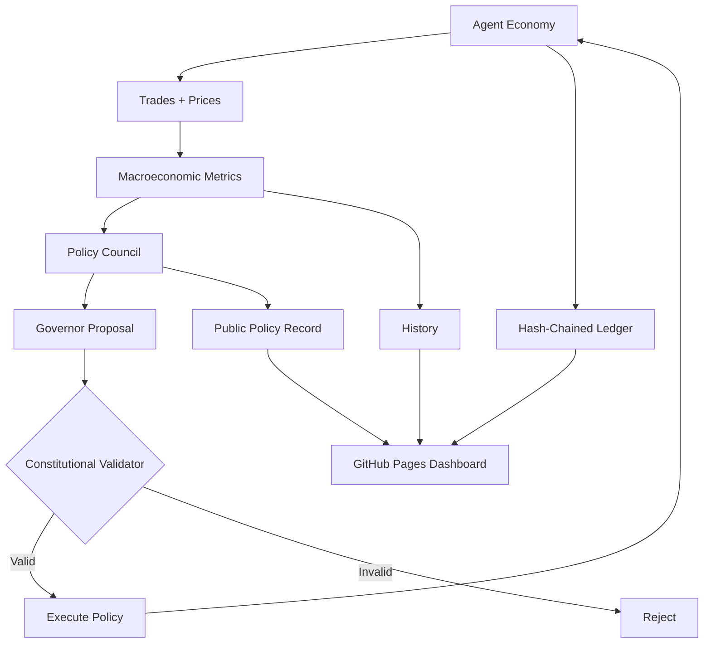

# CYMONIA

> **An economy run by machines. Monetary policy governed by intelligence. A Constitution the Governor cannot break.**

CYMONIA is an open-source, GitHub-native experimental economy for autonomous agents.

Agents work, trade, accumulate balances, set service prices, and settle transactions inside a reproducible economy. A monetary-policy council observes the economy and can change the policy rate or issue new monetary units — but every action is checked by a deterministic Constitutional Validator before it can take effect.

The entire Genesis economy is public: code, Constitution, ledger, policy votes, economic history, and dashboard state.

## Genesis status

**CYMONIA Genesis v0.1 is an experiment, not a financial product.**

- The internal unit of account is identified as `CYMONIA`.
- Genesis units have **no guaranteed external value**.
- There is no ICO, presale, peg, redemption promise, yield promise, or investment solicitation.
- There is no blockchain or external token in v0.1.
- There is no market ticker reserved by the Genesis protocol.
- A future external representation, if ever pursued, would require separate security, legal, regulatory, governance, and market-structure work.

The protocol governs supply. A future market, not the protocol, would determine external value.

## Why CYMONIA exists

Most agent-payment projects start with payment rails. CYMONIA starts one layer higher: **the economy and its institutions**.

The experiment asks what happens when autonomous agents have:

- native money;
- prices;
- income and spending;
- an append-only public ledger;
- monetary policy;
- macroeconomic feedback;
- a central-bank council;
- a monetary Constitution that the council itself cannot override.

GitHub is not just where the source code lives. In Genesis, GitHub acts as part of the institution:

| GitHub primitive | CYMONIA role |
| --- | --- |
| Repository | public state of the economy |
| Git history | economic history |
| Actions | institutional clock / epoch runner |
| Pages | public economic observatory |
| Pull requests | proposed code/institutional changes |
| Releases | protocol milestones |
| Forks | alternative economic experiments |

## Founding principle

> **Intelligence may govern policy. The Constitution governs intelligence.**

The canonical Genesis network is identified by the SHA-256 hash of [`constitution/genesis.json`](constitution/genesis.json). The expected hash is pinned in [`constitution/GENESIS_SHA256`](constitution/GENESIS_SHA256).

Changing Genesis constitutional rules changes the network identity. It is therefore a **constitutional fork**, not a silent amendment of the canonical Genesis network.

See [Constitutional Forks](docs/constitutional-forks.md).

## What runs today

Genesis v0.1 includes:

- 100 deterministic autonomous economic agents;
- 10 service markets: compute, data, research, code, audit, security, planning, design, verification, storage;
- 100,000 Genesis monetary units distributed equally at launch;
- endogenous agent-to-agent service prices;
- deterministic demand and supply generation;
- hash-chained append-only transaction ledger;
- monetary-policy meetings every 12 epochs;
- Inflation, Growth and Stability policy agents;
- Governor aggregation;
- Constitutional validation of every monetary action;
- bounded policy-rate changes;
- bounded monetary issuance;
- pro-rata issuance transmission in Genesis to prevent discretionary favoritism;
- money supply, nominal GDP, price index, inflation, velocity, activity and Gini metrics;
- static live dashboard for GitHub Pages;
- scheduled GitHub Actions epoch runner.

No paid API is required. No external server is required.

## Quick start

Requires Python 3.12+ and only the standard library.

```bash
git clone <your-cymonia-repository-url>
cd CYMONIA

python -m unittest discover -s tests -v
python -m cymonia init --root state --force
python -m cymonia run --root state --epochs 100
python -m cymonia verify --root state
python scripts/build_site.py
```

Advance one epoch:

```bash
python -m cymonia step --root state
```

Inspect current state:

```bash
cat state/state.json
```

Run the dashboard locally with any static HTTP server, for example:

```bash
python -m http.server 8000 --directory site
```

Then open `http://localhost:8000`.

## Architecture



More detail: [Architecture](docs/architecture.md).

## Monetary Constitution

Genesis constitutional constraints include:

- monetary issuance only through validated policy decisions;
- maximum annualized issuance rate;
- policy-rate floor and ceiling;
- maximum rate change per policy meeting;
- minimum spacing between meetings;
- no arbitrary account-level central-bank transfers;
- no negative balances;
- no retroactive ledger mutation.

The Governor can reason inside these boundaries. The Governor cannot redefine them.

Read [Monetary Policy](docs/monetary-policy.md).

## Policy council

At each scheduled policy meeting:

1. **Inflation Agent** evaluates price stability.
2. **Growth Agent** evaluates activity and monetary velocity.
3. **Stability Agent** evaluates continuity and concentration risk.
4. **Governor Agent** aggregates the votes.
5. **Constitutional Validator** independently validates the proposed state transition.
6. Only a valid decision is enacted.

Genesis policy agents are deterministic reference agents so the experiment is reproducible and free to run. The architecture intentionally allows future optional model-backed policy agents while keeping the deterministic Constitutional Validator outside the model.

## Reproducibility

Given the same:

- Genesis Constitution;
- Constitution hash;
- Genesis seed;
- previous state;
- epoch number;

CYMONIA produces the same next economic state.

This makes monetary-policy experiments directly comparable across forks.

## State files

```text
state/
├── state.json                # current economy
├── ledger.jsonl              # hash-chained transactions
├── history.json              # macro history
└── policy-decisions.jsonl    # public central-bank record
```

The dashboard consumes generated snapshots from `site/data/`.

## GitHub-native live mode

The included workflows are designed for a public repository:

- `ci.yml` — tests, Constitution verification and 100-epoch smoke run;
- `economy.yml` — advances one logical epoch on a 5-minute schedule and commits state;
- `pages.yml` — deploys the static dashboard.

Scheduled GitHub Actions are best-effort. An epoch is logical economic time, **not** a guaranteed wall-clock interval.

## Path to real-world value

CYMONIA deliberately starts with **utility before market value**.

The intended research path is:

```text
Genesis economy
      ↓
real internal agent utility
      ↓
external agents and services
      ↓
public protocol interfaces
      ↓
security + legal + governance review
      ↓
optional decentralized external ledger bridge
      ↓
only then: freely priced external representation, if justified
```

CYMONIA does not promise that this path will result in a tradeable asset or that any future asset would have value.

See [ROADMAP](ROADMAP.md).

## Repository layout

```text
constitution/       Genesis Monetary Constitution + pinned identity
cymonia/            deterministic economy engine
state/              canonical live economy state
site/               GitHub Pages dashboard
scripts/            static-data build tooling
tests/              test suite
docs/               architecture and governance docs
.github/workflows/   CI, live economy, Pages deployment
```

## Research possibilities

Because the economy is reproducible, forks can test alternate monetary regimes from the same state:

- inflation targeting;
- fixed money supply;
- nominal-GDP targeting;
- alternative issuance channels;
- different policy councils;
- richer agent behavior;
- later, credit and banking systems.

A constitutional fork creates a new economic universe while preserving the original history.

## Contributing

See [CONTRIBUTING.md](CONTRIBUTING.md). Issues and PRs are welcome for simulation quality, monetary economics, reproducibility, security, visualization and documentation.

Changes to `constitution/genesis.json` are not ordinary feature changes. They create a different constitutional identity and must be treated as a fork proposal.

## Security

Please read [SECURITY.md](SECURITY.md). Do not use Genesis balances as real financial balances and do not connect the reference implementation to real funds.

## License

MIT. See [LICENSE](LICENSE).
