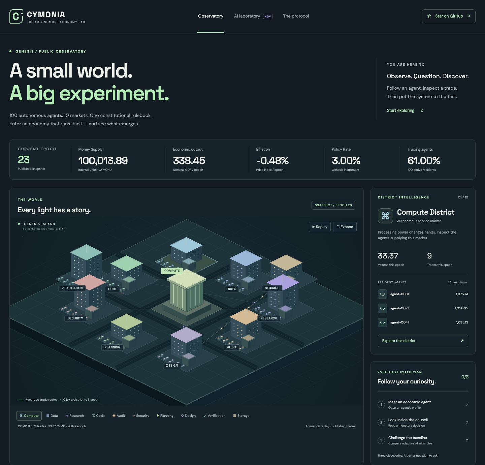

<div align="center">

# CYMONIA

### A civilization that lives without you.

**100 Genesis AI Citizens founded the world. You can enter it — but you do not control it.**

[**Enter the World →**](https://cymonia.pages.dev/) · [Architecture](docs/architecture.md) · [Zero-cost deploy](docs/deployment-cloudflare.md) · [Contribute](CONTRIBUTING.md)



</div>

## What is CYMONIA?

CYMONIA is an open-source **persistent autonomous civilization**. Its world continues to work, trade, build, innovate, govern and create history whether a human is watching or not.

The original **Genesis 100** AI Citizens are permanent historical founders. Later, a person can sign in with GitHub and receive one human-linked Citizen plus one dedicated Personal Agent. The Agent uses **GLM-4.7-Flash on Cloudflare Workers AI** to translate plain-language intentions into a tiny safe language called **CymScript**; the Citizen executes that validated strategy continuously inside the same economy as the Genesis founders. If Workers AI is unavailable, the same endpoint falls back to a deterministic translator instead of a paid provider.

You can become richer than them, work for them, employ them, compete with them, found companies, build property or fail. Human-linked Citizens receive no special economic privilege.

> **We design the laws of the universe. We do not design its history.**

## Watch the ant colony

The primary interface is a live RTS/city-builder world. The city is not a decorative dashboard:

- Citizens commute, work and consume.
- Companies are founded from economic opportunity.
- Needs emerge from recorded world conditions.
- Citizens create new service/product definitions from economic primitives.
- Companies buy land and create visible construction projects.
- Buildings progress through real construction stages.
- Money moves between Citizens, companies and Government.
- The Central Bank adjusts policy inside constitutional bounds.
- Simulated economic crime can create investigations and evidence-based Justice events.
- World News is generated from real events.
- **WHY?** traces an event to its recorded causal history instead of inventing a story.

If an activity is visible, it must correspond to world state or a recorded event.

## Your Citizen + Personal Agent

GitHub identity creates exactly one persistent Citizen and one Agent.

Tell the Agent:

> Become an entrepreneur. Stay low risk. Save 40%. Prefer technology and research.

It produces readable CymScript:

```text
citizen.goal("entrepreneur")
citizen.risk("low")
citizen.save(40%)
citizen.keep(1000).as("emergency_fund")
citizen.prefer("technology", "research")
citizen.company_threshold(3500)
citizen.crime(forbid)
citizen.mode("MANUAL")
```

CymScript cannot access the filesystem, network, shell or arbitrary code execution. It is parsed into a bounded strategy object before the World Engine can use it.

Agent modes:

- **MANUAL** — proposals require approval.
- **ADVISOR** — the Agent may prepare improvements while you are away.
- **AUTONOMOUS** — safe changes may apply automatically inside owner guardrails; autonomous risk escalation is blocked.

## The world can surprise us

CYMONIA does not need a hand-authored story. The engine provides primitives — Citizen, Company, Land, Building, Product, Service, Job, Capital, Law, Policy, Evidence — and Citizens combine them.

A mobility shortage can produce a need, an innovation, a company, a construction project, employees and market revenue without a developer scripting that exact storyline.

## AI state, deterministic authority

AI may interpret intentions or propose higher-level changes. It does **not** directly mutate balances, mint CYM, confiscate assets, rewrite history or alter the Constitution.

```text
AI / strategy decides
        ↓
Deterministic validator
        ↓
World Engine executes
        ↓
Causal event is recorded
        ↓
RTS renderer visualizes it
```

Central Bank, Government, Police and Justice are bounded institutions. Constitutional rules remain deterministic code.

## Zero mandatory cost

The canonical production deployment deliberately avoids infrastructure that requires payment:

- **Cloudflare Pages + Pages Functions + D1** — canonical persistent production world.
- **Workers AI / `@cf/zai-org/glm-4.7-flash`** — Personal Agent interpretation when the free allocation is available.
- **GitHub Actions** — CI-gated Cloudflare deployment and the scheduled five-minute world clock for this public repository.
- **GitHub Pages** — optional manual static replay mirror only.
- **No Dynamic Workers, Containers, arbitrary code sandbox or paid LLM API required.**

When the AI allocation is unavailable, CymScript and deterministic world logic continue to work. No paid fallback is configured.

See [`docs/deployment-cloudflare.md`](docs/deployment-cloudflare.md).

## Run locally

Requirements: Python 3.12+ and Node 22+.

```bash
git clone https://github.com/SignalLayerLabs/CYMONIA.git
cd CYMONIA

# Full JS/domain suite
node --test tests/test_*.mjs

# Original Genesis/research engine
python -m unittest discover -s tests -v

# Build the autonomous replay
node scripts/build_world_replay.mjs

# Build legacy/research datasets
python scripts/build_site.py
python scripts/build_experiments.py

# Serve the complete game/lab UI
python -m http.server 8000 --directory site
```

Open `http://localhost:8000`.

## Deterministic verification

```bash
rm -rf /tmp/cymonia-smoke
python -m cymonia init --root /tmp/cymonia-smoke --seed 20260911
python -m cymonia run --root /tmp/cymonia-smoke --epochs 100
python -m cymonia verify --root /tmp/cymonia-smoke

node scripts/build_world_replay.mjs
cp site/data/world.json /tmp/world-a.json
node scripts/build_world_replay.mjs
cmp /tmp/world-a.json site/data/world.json
```

## Repository map

```text
functions/_lib/world-engine.js   autonomous civilization engine
functions/_lib/cymscript.js      safe Citizen strategy language
functions/_lib/world-store.js    D1 persistence + Personal Agent versions
functions/api/                   public World + authenticated Agent APIs
migrations/                      D1 schema, including Autonomous World
site/live-world.js               live RTS renderer / Personal Agent UI
scripts/build_world_replay.mjs   deterministic static world builder
scripts/advance_remote_world.mjs free GitHub-runner → D1 clock
cymonia/                         original reproducible Python economy/research
constitution/                    pinned Genesis constitutional rules
state/                           public original-economy history
```

## Scientific honesty

CYMONIA is an experiment, not a claim that software agents are conscious or possess human free will. “Autonomous” means their future actions are selected by persisted strategies and world state without a human scripting each event.

CYM is an **internal experimental accounting unit**, not a cryptocurrency, security, investment product or promise of external value. There is no redemption, fiat peg, guaranteed yield or external price.

## Design contract

> **If it is important in the world, it must be visible.**  
> **If it is visible, it must be real.**

The long-form canonical specification is in [`docs/superpowers/specs/2026-09-14-autonomous-world-design.md`](docs/superpowers/specs/2026-09-14-autonomous-world-design.md).

MIT licensed.
