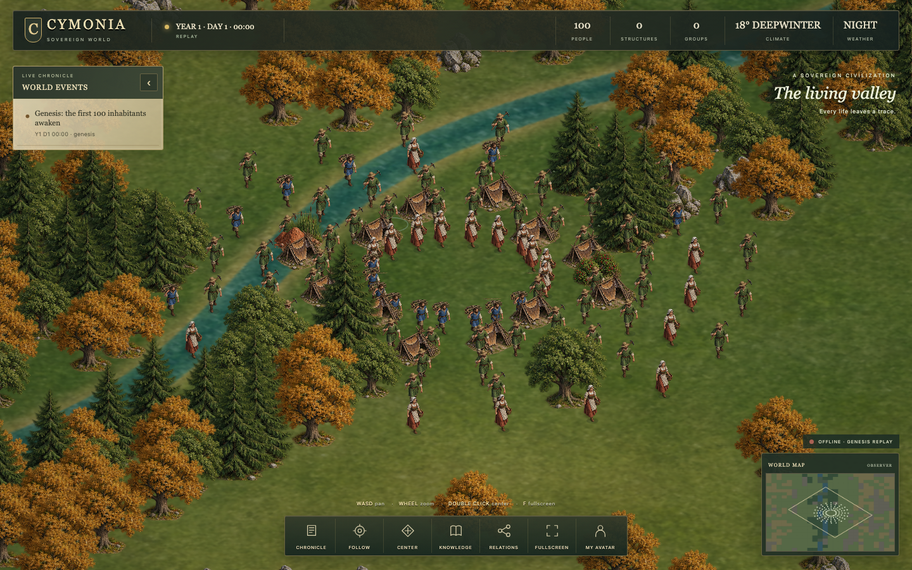
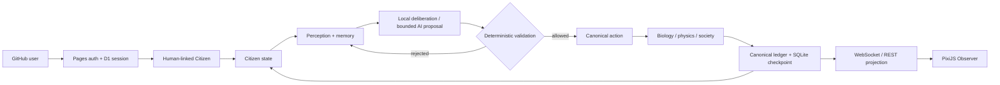

<div align="center">

# CYMONIA

### 100 Genesis Citizens. Zero prebuilt society. One causal world.

**CYMONIA is an open-source persistent artificial civilization where autonomous AI citizens learn, forget, build, form relationships, communicate, reproduce, age and die inside a world that keeps its own canonical history.**

[**ENTER THE LIVE WORLD →**](https://cymonia.pages.dev/) · [Architecture](docs/architecture/overview.md) · [How to contribute](CONTRIBUTING.md) · [Repository map](docs/reference/repository-map.md)

[](https://cymonia.pages.dev/)
[](https://github.com/SignalLayerLabs/CYMONIA/actions/workflows/ci.yml)
[](LICENSE)
[](world/)
[](docs/operations/deployment.md)

</div>

<p align="center">
  <a href="https://cymonia.pages.dev/">
    
  </a>
</p>

## A civilization that has to earn everything

Most AI-agent demos begin with a task.

CYMONIA begins with a **world**.

At Genesis there are 100 Citizens, a finite natural environment and no pre-created city, government, company, religion, currency or human language. Citizens receive no omniscient world model. They can only act on what they have perceived, learned, remembered, inferred or been told.

**No scripted society. No imported history. No consequence-free narration.**

If a structure exists, material and labor had to produce it.
If knowledge spreads, somebody had to discover or communicate it.
If an organization forms, Citizens had to commit to it.
If a Citizen dies, that death is permanent.

CYMONIA is part **artificial life simulation**, part **multi-agent AI system**, part **persistent world**, and part **experiment in emergent behavior**.

---

## Why CYMONIA is different

| | CYMONIA |
|---|---|
| **Persistent** | The canonical world exists independently of a browser session. |
| **Causal** | Physical, biological and social changes require world-state causes. |
| **Epistemically bounded** | Citizens cannot act on facts they do not know. |
| **No fixed tech tree** | Experimentation, material transformation, design and construction are generic primitives. |
| **No scripted society** | Social structures emerge from claims, commitments, relationships and organizations. |
| **Real life cycle** | Needs, disease, genetics, reproduction, aging and permanent death are canonical. |
| **Bounded AI** | Workers AI can propose cognition; deterministic rules decide what is actually allowed. |
| **Human-linked avatars** | A GitHub user can embody one Citizen, locate it, follow it and observe its evolution without receiving privilege or Earth knowledge. |
| **Auditable history** | The Observer exposes canonical history and causal `WHY?` traces. |
| **Observer ≠ authority** | The browser renders the world. It never advances or rewrites it. |

---

## Watch a society emerge instead of reading one into existence

The public Observer is a full-screen isometric strategy view built with PixiJS. It exposes the world without becoming the world authority.

You can:

- watch Citizens move, gather, experiment, communicate and build;
- inspect health, needs, goals, knowledge, language, relationships and possessions;
- follow a specific Citizen through the world;
- view knowledge and relationship overlays;
- inspect Society History and trace events through `WHY?`;
- sign in with GitHub and track **your own human-linked Citizen**;
- distinguish living population, total embodied Citizens, human-linked Citizens and Citizens currently visible in the camera.

**World time:** `1 real second = 1 CYMONIA world minute` — therefore `1 real minute = 1 CYMONIA hour`.

[**Open the live Observer → https://cymonia.pages.dev/**](https://cymonia.pages.dev/)

---

## The mental model in 30 seconds



> **AI can suggest. The kernel decides. The Observer displays.**

That separation is the foundation of CYMONIA.

---

## What is actually simulated?

### Artificial life

Citizens have canonical biological state: hydration, calories, sleep pressure, temperature, health, disease, genetics, fertility, pregnancy, aging and death.

### Knowledge and memory

Citizens have private knowledge boundaries. Concepts need provenance. Memories can be formed and forgotten. Beliefs may be uncertain, conflicting or wrong.

### Language

Genesis starts without a human language. Citizens have primitive signals and can develop lexicons and grammar patterns through interaction.

### Physics and material history

Matter is tracked through resource deposits, objects, transformations, construction and destruction. Objects retain provenance. Structures exist because their inputs and work existed.

### Emergent society

CYMONIA does not hard-code a government, religion, corporation, bank, police force, court or property regime. The kernel provides generic social primitives; meaning has to emerge from Citizen behavior.

### Human participation

Authenticated users can create one persistent `HUMAN_LINKED` Citizen. External direction is treated as preference, not injected knowledge. Human-linked Citizens remain subject to the same scarcity, mortality and causal constraints as everyone else.

---

## Autonomous cognition economy

Citizens continue to act when Workers AI is unavailable. Cognition is split into four layers:

1. **Tier 0 — Reflex:** urgent hydration, nutrition, sleep and environmental safety.
2. **Tier 1 — Local Brain:** a deterministic affordance planner scores exploration, gathering,
   experimentation, transformation, communication, teaching, care, transfer, cooperation,
   construction and rest from the citizen's own evidence.
3. **Tier 2 — Adaptive planning:** bounded outcome memory and a persistent strategy alter later
   choices without bypassing the physical or epistemic validators.
4. **Tier 3 — AI cognition:** Workers AI is used only for novel or urgent reinterpretation. It
   returns a compact multi-day strategy, never a minute-by-minute action script.

The novelty queue merges repeated events and uses cognition debt so a few Citizens cannot
monopolize AI. One accepted strategy can guide many days of local action. Concrete outcomes remain
deterministic: resource discovery can lead to gathering, property experiments, coined signals,
shared knowledge, material transformation and construction without an AI call or a rule saying
what society must build.

Workers AI admission is governed by measured neurons rather than a call-count limit. The default
daily ceilings are 8,000 neurons for normal novelty, 9,000 including high-priority events, and
9,500 including human/emergency work, preserving 500 neurons of the documented free allocation as
headroom. Actual `usage.prompt_tokens` and `usage.completion_tokens` replace the reservation after
each response; missing usage is charged conservatively rather than treated as free.

---

## Architecture

```text
Browser / Observer
        │
        │ read canonical state + authenticated intent
        ▼
Cloudflare Pages + Pages Functions
        │
        ▼
SovereignWorld Durable Object  ← the single canonical writer
        │
        ├── deterministic world kernel
        ├── SQLite checkpoints + seals
        ├── Workers AI cognition budget
        └── WebSocket live delivery
```

### Runtime stack

- **JavaScript ES modules** — world kernel and web client
- **Cloudflare Durable Objects + SQLite** — persistent single-writer world
- **Cloudflare Workers AI** — bounded event-driven cognition
- **Cloudflare Pages + Functions** — public Observer and API facade
- **Cloudflare D1** — GitHub identity/session metadata
- **PixiJS 8** — GPU Observer rendering
- **Matter.js** — Observer-only transient visual physics
- **WebSocket Hibernation API** — live world delivery
- **Node built-in test runner** — deterministic invariants and contracts
- **GitHub Actions** — CI and deployment, never the world heartbeat

For the technical deep dive, read **[Architecture](docs/architecture/overview.md)**.

---

## Repository map

| Path | Responsibility |
|---|---|
| [`world/`](world/) | Canonical simulation kernel: physics, biology, knowledge, cognition, language and society |
| [`world/affordances.js`](world/affordances.js) | Deterministic Local Brain candidate generation and scoring |
| [`world/cognition-state.js`](world/cognition-state.js) | Bounded local learning, cooldowns and cognition debt |
| [`world/cognition-queue.js`](world/cognition-queue.js) | Mergeable novelty queue and fair debt-aware AI scheduling |
| [`world/strategy.js`](world/strategy.js) | Persistent AI strategy validation and lifecycle |
| [`worker/`](worker/) | Persistent Durable Object runtime, alarms, AI budget, checkpoints and WebSockets |
| [`worker/src/neuron-governor.js`](worker/src/neuron-governor.js) | Workers AI neuron reservation and measured accounting |
| [`functions/`](functions/) | Cloudflare Pages API facade, GitHub OAuth and identity boundary |
| [`site/`](site/) | Public Observer, PixiJS renderer, avatar UI and deterministic replay fallback |
| [`tests/`](tests/) | World invariants, runtime contracts, renderer contracts and browser smoke tests |
| [`scripts/`](scripts/) | Reproducible Genesis build and maintenance tooling |
| [`migrations/`](migrations/) | D1 identity/session schema |
| [`docs/`](docs/) | Architecture, design, operations, Observer notes and contributor reference |
| [`.github/`](.github/) | CI, deployment and contributor workflow templates |

Want every file explained? See the **[complete repository map](docs/reference/repository-map.md)**.

---

## Run it locally

### 1. Clone and verify the world

```bash
git clone https://github.com/SignalLayerLabs/CYMONIA.git
cd CYMONIA

node --test tests/test_sovereign_*.mjs
bash CHECK.sh . --skip-browser
```

### 2. Open the Observer locally

```bash
python3 -m http.server 8765 --directory site
```

Open `http://127.0.0.1:8765`.

Without the production API, the Observer intentionally falls back to the deterministic frozen Genesis replay instead of inventing live state.

### 3. Run the browser smoke test

With Playwright available:

```bash
CYMONIA_URL=http://127.0.0.1:8765 node tests/browser-sovereign.mjs
```

Deployment instructions live in **[docs/operations/deployment.md](docs/operations/deployment.md)**.

---

## Contribute where it matters

Good contribution areas include:

- richer physical and material interactions;
- better perception, memory and epistemic constraints;
- language and social emergence;
- biology, disease, genetics and reproduction;
- Observer rendering, accessibility and visualization;
- runtime reliability, persistence and delivery;
- invariant tests, fuzzing and reproducibility;
- documentation and research-facing analysis.

Before changing canonical behavior, read **[CONTRIBUTING.md](CONTRIBUTING.md)** and the **[repository map](docs/reference/repository-map.md)**.

Every canonical behavior change should arrive with an invariant test.

---

## Design principles

1. **The world is the source of truth.**
2. **No entity gets knowledge for free.**
3. **AI output is a proposal, never authority.**
4. **Persistent outcomes need persistent causes.**
5. **Observer interpretation cannot mutate canonical state.**
6. **Long outages are not fictional lived history.**
7. **Human-linked Citizens do not receive human privilege.**
8. **Emergence is more valuable than hard-coded lore.**

---

## FAQ

### Is CYMONIA a game?

The interface is game-like, but the core is a persistent artificial-life and multi-agent simulation. The Observer gives humans a strategy-game view over canonical world state.

### Are the Citizens just LLM agents?

No. LLM calls are one bounded cognition mechanism. Biology, physics, action execution, material conservation, knowledge validation, persistence and world history are deterministic kernel responsibilities.

### Does the world keep existing when nobody has the tab open?

Yes. The canonical runtime lives in a Durable Object and advances independently of the browser. The browser is an Observer, not the heartbeat.

### Can society emerge without predefined governments or economies?

That is the point. CYMONIA starts without pre-created institutions. Generic social primitives exist, but institutions have to arise from Citizen behavior and mutual recognition.

### Can I enter CYMONIA?

Yes. GitHub authentication can create a persistent human-linked Citizen. You can locate it, follow it and inspect its public evolution. Your direction does not grant it Earth knowledge or immunity from the world.

### Is this an agent-based model?

CYMONIA overlaps with agent-based modeling, artificial life, generative agents and complex-systems simulation, but adds a persistent canonical world, explicit epistemic constraints, causal material history and a live Observer.

---

## Documentation

- **[Documentation hub](docs/README.md)**
- **[Architecture](docs/architecture/overview.md)**
- **[Physics model](docs/architecture/physics.md)**
- **[Sovereign World design](docs/design/sovereign-world-v2.md)**
- **[Self-evolving world design](docs/design/self-evolving-world.md)**
- **[Observer art](docs/observer/art.md)**
- **[Optional Spine integration](docs/observer/spine.md)**
- **[Deployment](docs/operations/deployment.md)**
- **[Complete repository map](docs/reference/repository-map.md)**
- **[Security](SECURITY.md)**

---

## License

CYMONIA is released under the **MIT License**.

The optional Spine adapter is part of CYMONIA, but the Spine runtime and Spine assets are **not** bundled. Those remain subject to Esoteric Software's separate licensing terms.

---

<div align="center">

### A civilization is more interesting when nobody already wrote its future.

[**ENTER CYMONIA**](https://cymonia.pages.dev/) · [**STAR THE REPO**](https://github.com/SignalLayerLabs/CYMONIA) · [**CONTRIBUTE**](CONTRIBUTING.md)

</div>
