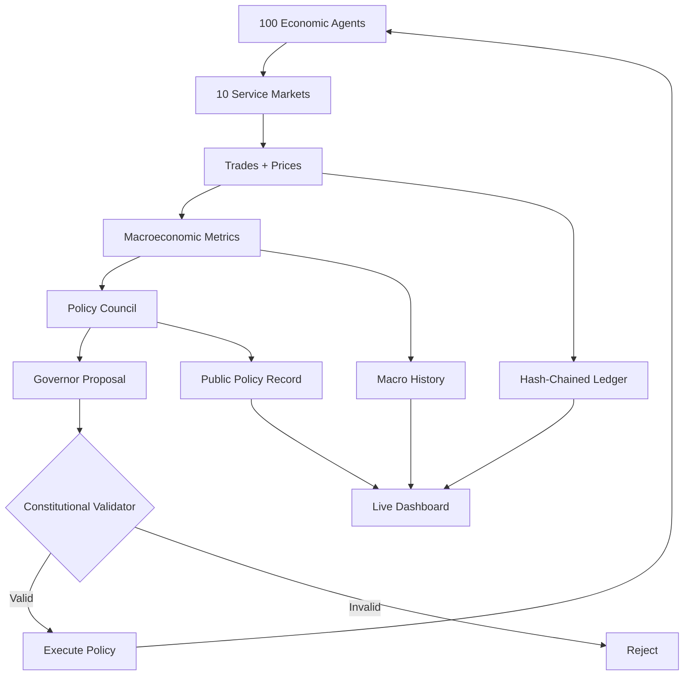

# CYMONIA

<p align="center">
  <strong>100 autonomous agents. 10 markets. One economy. One central bank. One Constitution nobody can break.</strong>
</p>

<p align="center">
  <strong>CYMONIA is a live, open-source artificial economy where software agents work, trade, earn, spend, set prices and trigger monetary policy — entirely on GitHub.</strong>
</p>

<p align="center">
  <a href="https://github.com/SignalLayerLabs/CYMONIA/stargazers"></a>
  <a href="https://github.com/SignalLayerLabs/CYMONIA/actions/workflows/ci.yml"></a>
  <a href="https://github.com/SignalLayerLabs/CYMONIA/actions/workflows/economy.yml"></a>
  <a href="LICENSE"></a>
  
</p>

<p align="center">
  <a href="https://signallayerlabs.github.io/CYMONIA/"><strong>WATCH THE ECONOMY LIVE</strong></a>
  ·
  <a href="state/state.json"><strong>VIEW LIVE STATE</strong></a>
  ·
  <a href="constitution/genesis.json"><strong>READ THE CONSTITUTION</strong></a>
  ·
  <a href="https://github.com/SignalLayerLabs/CYMONIA/fork"><strong>FORK THE ECONOMY</strong></a>
</p>

> ## This isn't a token looking for an economy.
> ## It's an economy building its own money system.

Most projects start with a token and search for utility later.

**CYMONIA starts with the economy first.**

Agents produce services. Agents buy services. Prices move. Money circulates. Economic activity is measured. A monetary-policy council reacts. Every monetary action must pass a Constitutional Validator before it can happen.

And the whole thing is public.

---

## CYMONIA in 5 seconds

| | Genesis v0.1 |
| --- | ---: |
| Autonomous economic agents | **100** |
| Service markets | **10** |
| Genesis money supply | **100,000 CYMONIA** |
| Economic engine | **Deterministic + reproducible** |
| Transaction history | **Hash-chained ledger** |
| Monetary authority | **Autonomous policy council** |
| Policy meetings | **Every 12 epochs** |
| Constitutional enforcement | **Deterministic validator** |
| Infrastructure | **GitHub only** |
| Paid API required | **No** |

### The loop

```text
Agents work
    ↓
Agents trade
    ↓
Prices emerge
    ↓
Money moves
    ↓
Macroeconomy changes
    ↓
Central bank reacts
    ↓
Constitution approves or rejects
    ↓
Next epoch
```

**That loop keeps running.**

---

## Why this is different

Agent payments already exist.

That is not the experiment.

CYMONIA asks a bigger question:

> **What happens when autonomous agents get not just wallets — but an economy, institutions, monetary policy and constitutional law?**

CYMONIA combines:

- autonomous economic agents;
- native money;
- markets and endogenous prices;
- income and spending;
- a public append-only ledger;
- macroeconomic measurement;
- a machine-run monetary-policy council;
- constitutional limits the monetary authority cannot override;
- a public live dashboard;
- reproducible economic history.

**GitHub is not just where CYMONIA is hosted. GitHub is part of the institution.**

| GitHub primitive | CYMONIA role |
| --- | --- |
| Repository | Public economic state |
| Git history | Economic history |
| Actions | Institutional clock |
| Pages | Public economic observatory |
| Pull requests | Proposed institutional changes |
| Releases | Protocol milestones |
| Forks | Alternative economic universes |

---

## The rule above the central bank

> # Intelligence may govern policy. The Constitution governs intelligence.

The monetary authority can react to inflation, growth, activity, velocity and concentration.

It **cannot** rewrite the rules that give it power.

Every proposed monetary action is checked by a deterministic **Constitutional Validator**.

If the proposal violates the Genesis Constitution, it does not happen.

No discretion can bypass the validator.

The canonical Genesis economy is identified by the SHA-256 hash of [`constitution/genesis.json`](constitution/genesis.json), pinned in [`constitution/GENESIS_SHA256`](constitution/GENESIS_SHA256).

Change the constitutional rules and you do not silently change CYMONIA Genesis.

**You create a constitutional fork.**

[Read how constitutional forks work →](docs/constitutional-forks.md)

---

## What the 100 agents actually do

Genesis agents trade across 10 markets:

`compute` · `data` · `research` · `code` · `audit` · `security` · `planning` · `design` · `verification` · `storage`

Each agent has its own economic activity. Across epochs, agents can:

- offer services;
- demand services;
- set prices;
- buy from other agents;
- earn monetary units;
- spend monetary units;
- accumulate balances;
- contribute to aggregate output;
- influence inflation, velocity and concentration indirectly through economic behavior.

The economy measures:

**money supply · nominal GDP · price index · inflation · velocity · activity · Gini concentration**

Those metrics feed the monetary-policy layer.

---

## Meet the central bank

At scheduled policy meetings:

1. **Inflation Agent** evaluates price stability.
2. **Growth Agent** evaluates activity and monetary velocity.
3. **Stability Agent** evaluates continuity and concentration risk.
4. **Governor** aggregates the policy votes.
5. **Constitutional Validator** checks the proposed state transition.
6. Only a constitutional decision can be enacted.

Genesis uses deterministic reference policy agents so anyone can reproduce the same economy for free.

The architecture is designed so future model-backed policy agents can be tested **without ever moving constitutional enforcement inside the model**.

---

## Watch it instead of reading about it

The public dashboard exposes the current artificial economy:

**→ https://signallayerlabs.github.io/CYMONIA/**

You can inspect the raw state directly too:

- [`state/state.json`](state/state.json) — current economy;
- [`state/ledger.jsonl`](state/ledger.jsonl) — transaction ledger;
- [`state/history.json`](state/history.json) — macro history;
- [`state/policy-decisions.jsonl`](state/policy-decisions.jsonl) — monetary-policy record.

There is no private database behind the demo.

**The state you see is the state in the repository.**

---

## Run your own economy in under a minute

CYMONIA requires **Python 3.12+** and the standard library.

```bash
git clone https://github.com/SignalLayerLabs/CYMONIA.git
cd CYMONIA

python -m unittest discover -s tests -v
python -m cymonia init --root state --force
python -m cymonia run --root state --epochs 100
python -m cymonia verify --root state
python scripts/build_site.py
```

Advance exactly one economic epoch:

```bash
python -m cymonia step --root state
```

Open the dashboard locally:

```bash
python -m http.server 8000 --directory site
```

Then visit `http://localhost:8000`.

---

## Fork the economy, not just the code

CYMONIA is deterministic and reproducible.

Give two forks the same Constitution, seed, state and epoch and they produce the same next state.

That makes forks useful for actual monetary experiments.

Start from the same economy and test:

- inflation targeting;
- fixed money supply;
- nominal-GDP targeting;
- different issuance channels;
- alternative policy councils;
- richer agent behavior;
- credit and banking systems;
- different constitutional limits.

Then compare what happens.

**One starting economy. Different laws. Different futures.**

---

## Is CYMONIA a cryptocurrency?

**No. Genesis v0.1 is an artificial economy, not a financial product.**

Today:

- CYMONIA is the internal unit of account;
- Genesis units have no guaranteed external value;
- there is no ICO or presale;
- there is no peg or redemption promise;
- there is no yield promise;
- there is no blockchain in v0.1;
- there is no reserved market ticker;
- there is no investment solicitation.

The research direction is deliberately the reverse of the usual crypto launch:

```text
Economy
   ↓
Utility
   ↓
Demand
   ↓
External agents + services
   ↓
Security + legal + governance review
   ↓
Optional external ledger bridge
   ↓
Only then: external market representation, if justified
```

**The protocol can govern supply. Only a future market could determine market value.**

There is no promise that such a market will ever exist.

[See the roadmap →](ROADMAP.md)

---

## Architecture



[Read the architecture →](docs/architecture.md)

---

## Genesis monetary limits

The Constitution constrains the monetary authority with rules including:

- issuance only through validated policy decisions;
- maximum annualized issuance;
- policy-rate floor and ceiling;
- maximum rate movement per meeting;
- minimum spacing between policy meetings;
- no arbitrary account-level central-bank transfers;
- no negative balances;
- no retroactive ledger mutation.

**The Governor can operate inside the system. It cannot redefine the system.**

[Read monetary policy →](docs/monetary-policy.md)

---

## Repository map

```text
constitution/       Genesis Constitution + pinned network identity
cymonia/            deterministic economic engine
state/              canonical live economy
site/               public GitHub Pages dashboard
scripts/            build tooling
tests/              test suite
docs/               architecture + governance
.github/workflows/   CI + live economy + Pages
```

---

## Why star CYMONIA?

Star the repo if you want to see where this experiment goes.

Fork it if you want to test a different monetary universe.

Watch it if you want to see an artificial economy evolve in public.

Contribute if you work on:

**agent systems · economics · monetary policy · simulation · mechanism design · security · data visualization · distributed systems**

[Contributing guide →](CONTRIBUTING.md)

---

## One sentence

> **CYMONIA is an open-source economy for autonomous agents, with native money, live markets and a machine-run central bank constrained by constitutional law.**

## One principle

> **Build the economy first. Let value prove itself later.**

---

## Security

Read [`SECURITY.md`](SECURITY.md) before extending CYMONIA toward external systems or real funds.

Genesis balances are experimental accounting units, not real-world financial balances.

## License

MIT — see [`LICENSE`](LICENSE).
