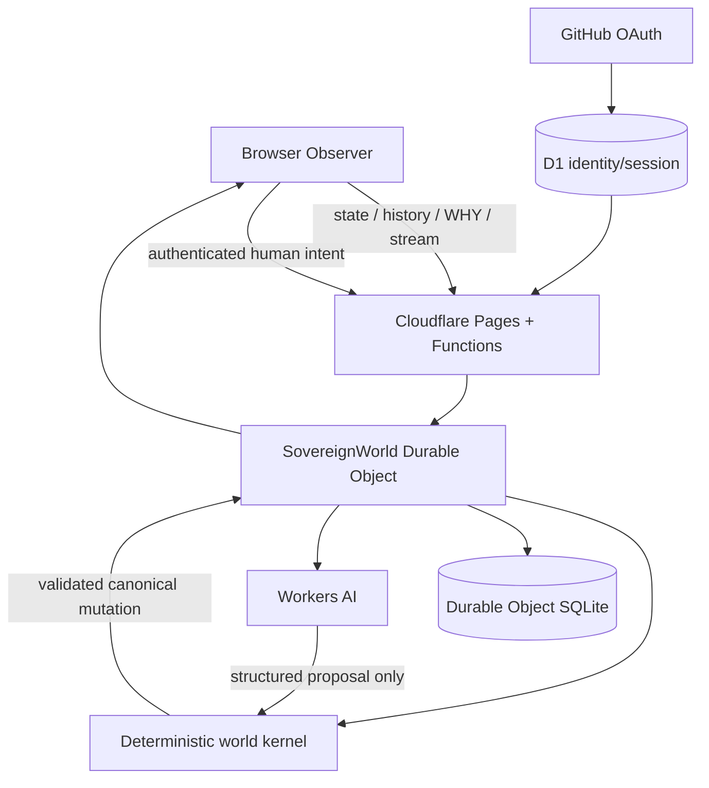

# CYMONIA Architecture

CYMONIA is a persistent artificial civilization with a deliberately strict authority model: **one canonical world, one canonical writer, many observers**.

The architecture prevents narration, UI state or an LLM response from becoming reality merely because it was generated.

## Authority boundary

The canonical mutation authority is the `SovereignWorld` Cloudflare Durable Object.

| Layer | Canonical mutation? | Role |
|---|---:|---|
| `world/` kernel | Through validated execution | deterministic rules |
| `SovereignWorld` Durable Object | **Yes** | single writer and runtime authority |
| Workers AI | No | proposes bounded cognition |
| Pages Functions | No | authentication and proxy boundary |
| D1 identity store | No | external account/session metadata |
| Browser Observer | No | visualization and authenticated intent |
| GitHub Actions | No | CI and deployment |

## Runtime cycle

1. Load persisted world or create deterministic Genesis.
2. Durable Object alarm wakes the runtime.
3. `advanceWorldBounded()` advances due world events.
4. Biology, environment, actions and social effects execute causally.
5. Local deliberation keeps Citizens active between AI decisions.
6. High-priority cognition may call Workers AI within a hard daily budget.
7. AI output is parsed into a constrained proposal.
8. Epistemic/action validation rejects illegal knowledge or impossible actions.
9. Accepted actions enter canonical execution.
10. The world is checkpointed and periodically sealed.
11. REST and WebSocket projections expose public state to Observer clients.

## Kernel domains

**Foundations:** `constants.js`, `clock.js`, `rng.js`, `ledger.js`
**Physical world:** `materials.js`, `terrain.js`, `environment.js`, `actions.js`, `artifacts.js`, `designs.js`, `impact.js`
**Life:** `biology.js`, `genetics.js`, `disease.js`, `reproduction.js`
**Knowledge:** `perception.js`, `epistemics.js`, `memory.js`, `beliefs.js`, `cognition.js`
**Society:** `language.js`, `society.js`
**Integration:** `genesis.js`, `observer.js`, `engine.js`

## Epistemic boundary

A Citizen does not receive global state simply because the server has it. Cognitive context is built from legitimately known concepts, perception, memories, relationships and allowed external direction. Unknown concepts are rejected when a proposal tries to use them.

## Persistence

The Durable Object stores compressed, chunked snapshots in SQLite-backed storage with bounded row-write accounting, periodic SHA-256 seals and alternating slots.

A long runtime outage does **not** automatically become lived Citizen history. Recovery rebases the real-time boundary and persists it before hibernation can discard the recovery.

## Human-linked Citizens

GitHub identity exists outside the world. An authenticated user can resolve or create one `HUMAN_LINKED` Citizen. Embodiment consumes finite reserve, gives no Earth knowledge and grants no special physics. User direction enters as preference, not factual truth.

## Observer boundary

The Observer may animate, interpolate, classify and explain canonical state. Those derivations cannot create buildings, give Citizens knowledge or rewrite history.

See [`../reference/repository-map.md`](../reference/repository-map.md) for the complete code map and [`../operations/deployment.md`](../operations/deployment.md) for production topology.
