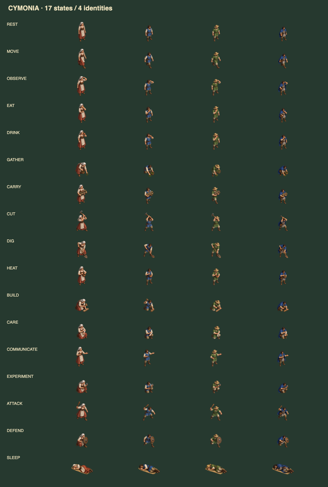

# Citizen state sprites

The Observer illustrates all 25 canonical action types through the 17 animation states in `site/citizen-animation.js`. Each identity has 16 new action poses; the existing four sleep poses complete the set of 68. These are state key poses, with the existing procedural motion layered on top in Pixi, rather than multi-frame animation clips.

The three Genesis appearances retain the existing stable citizen-id hash. Human-linked Citizens retain the blue-cape appearance. No canonical action, possession, capability, or world outcome is created by the artwork. Handheld objects are visual action cues, not assertions about inventory.



## Assets and frame order

| Variant | Asset | Appearance |
| --- | --- | --- |
| 0 | `site/assets/citizen-blue-states.png` | Blue tunic |
| 1 | `site/assets/citizen-rust-states.png` | White headscarf and rust skirt |
| 2 | `site/assets/citizen-green-states.png` | Green tunic and straw hat |
| 3 | `site/assets/citizen-linked-states.png` | Blue cape and satchel |

The PNGs are transparent, 1254 × 1254 pixels. Their row-major frame order is:

| Row | Column 1 | Column 2 | Column 3 | Column 4 |
| --- | --- | --- | --- | --- |
| 1 | idle | walk | observe | eat |
| 2 | drink | gather | carry | cut |
| 3 | dig | work | build | care |
| 4 | communicate | experiment | attack | defend |

`site/citizen-sprite-frames.js` records measured alpha bounds because the generated art is not aligned precisely to equal cells. Canvas and Pixi use these same rectangles, identity mapping, scale reference and alpha masks. The idle frame fixes each identity's scale so a wider tool does not shrink its holder. Missing atlases fall back to the original standing sprite. Sleep uses `site/assets/medieval-sleep-atlas.png`; unknown or absent actions use idle.

The shared states preserve the existing animation contract: REST/REPRODUCE → idle; HEAT/COOL/MIX → work; ASSEMBLE/BUILD → build; CARE → care; TEACH/COMMUNICATE/PROMISE/CLAIM → communicate; TRANSFER/CARRY → carry. Other actions use their corresponding state.

## Verification

Run `node --test tests/test_sovereign_*.mjs` and `bash CHECK.sh .`. For the full sprite integration test, install `playwright` and `pixi.js@8.19.0`, serve `site/`, then run:

```sh
CYMONIA_URL=http://127.0.0.1:8765 node tests/browser-state-sprites.mjs
```

The integration test uses local Pixi rather than a CDN. It exercises real Canvas and WebGL, all 68 identity/state combinations, waking transitions, pixel coverage, transformed alpha hit testing, and world-state immutability. It writes a labeled contact sheet to `test-results/state-sprites/all-states.png`.

## Artwork provenance and prompt

Generated with the built-in OpenAI image-generation tool on 2026-09-29, using the repository's `medieval-atlas.png` as the identity and style reference. The four outputs were copied without resampling or pixel edits. Each request used this prompt, followed by its identity description:

```text
Use case: stylized-concept. Production game asset for CYMONIA. Generate ONE transparent RGBA sprite atlas, square 1536x1536, a STRICT equally spaced 4 columns x 4 rows grid, exactly sixteen full-body sprites of ONE SAME medieval character. The supplied image is STYLE AND IDENTITY REFERENCE: use only the specified character from its bottom row; do not reproduce trees/buildings/other characters. Refined hand-painted isometric strategy-game art, matching reference, earthy colors, overhead 3/4 view, character facing down-right. Transparent background, no floor tiles, no large shadows, no labels, no text, no borders, no grid lines. Each pose entirely contained within its own equal cell with at least 12% clear margin on all edges; no neighboring overlap. Same character identity, costume, scale, lighting in all sixteen cells. Feet at a consistent baseline, full body including boots. One SINGLE static key pose per action, no duplicate frames. The EXACT row-major order is:
row 1 col 1: IDLE, relaxed standing, empty hands; col 2 WALK, clear stride, arms swinging, empty hands; col 3 OBSERVE, hand shading brow looking outward; col 4 EAT, eating a piece of bread raised to mouth.
row 2 col 1: DRINK, drinking from clay cup; col 2 GATHER, bending down collecting herbs in a small basket; col 3 CARRY, carrying two bundled logs against chest; col 4 CUT, raising a small wood axe with both hands to chop, no stump.
row 3 col 1: DIG, working with a long wooden shovel blade down; col 2 WORK, stirring a small earthen pot held at waist; col 3 BUILD, kneeling with mallet and one small wooden plank; col 4 CARE, kneeling carefully wrapping a white cloth bandage around own forearm.
row 4 col 1: COMMUNICATE, standing with open expressive hand gesture; col 2 EXPERIMENT, crouching examining a mineral in one hand with tiny clay bowl in other; col 3 ATTACK, leaning forward with short wooden club raised; col 4 DEFEND, crouched defensive stance with a small round wooden shield.
No modern objects, no armor, no additional people, no scenery. These small props are visual action cues.
```

Identity descriptions:

- Blue: bearded brown-haired man in a blue sleeveless tunic over a cream shirt, brown belt, tan trousers and brown boots; no backload except where the action calls for logs.
- Rust: woman with white headscarf, cream blouse and apron over a rust-red skirt, brown bodice and brown boots; retain the headscarf and skirt throughout.
- Green: bearded man with a wide straw hat, green tunic over a cream shirt, brown belt, beige trousers and boots; retain the straw hat and tunic throughout.
- Linked: dark-haired bearded man with blue cape, brass round clasp, grey tunic, brown belt and satchel, tan trousers and brown boots; retain cape and satchel throughout.
